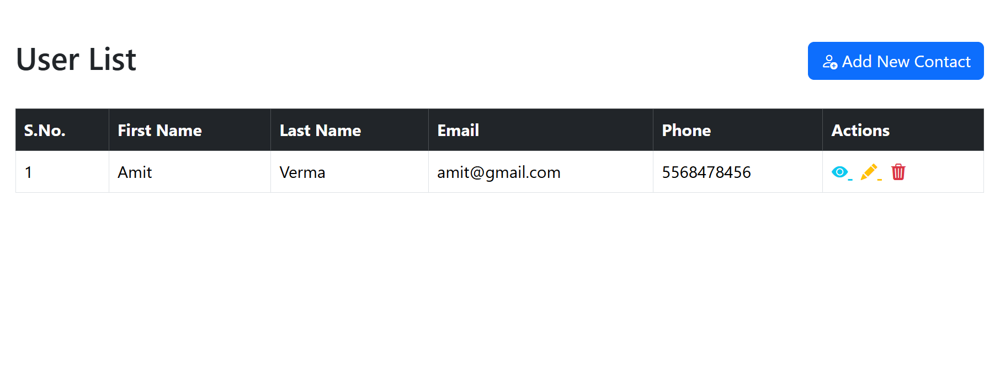
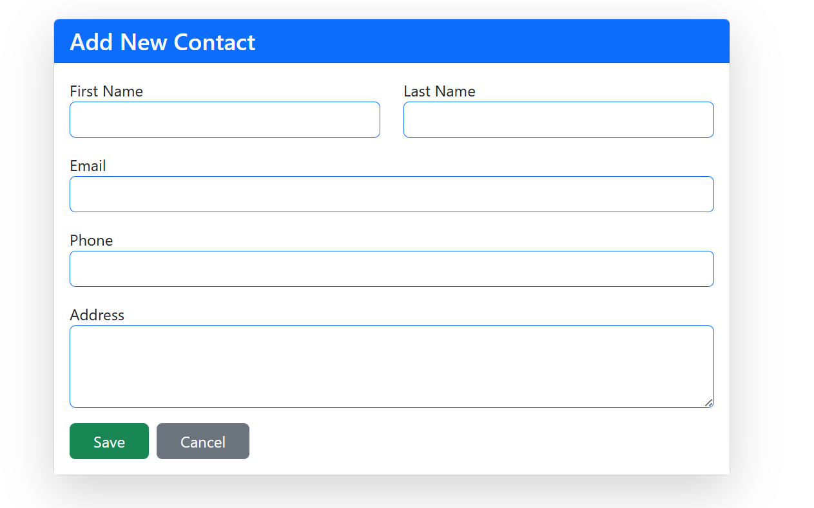
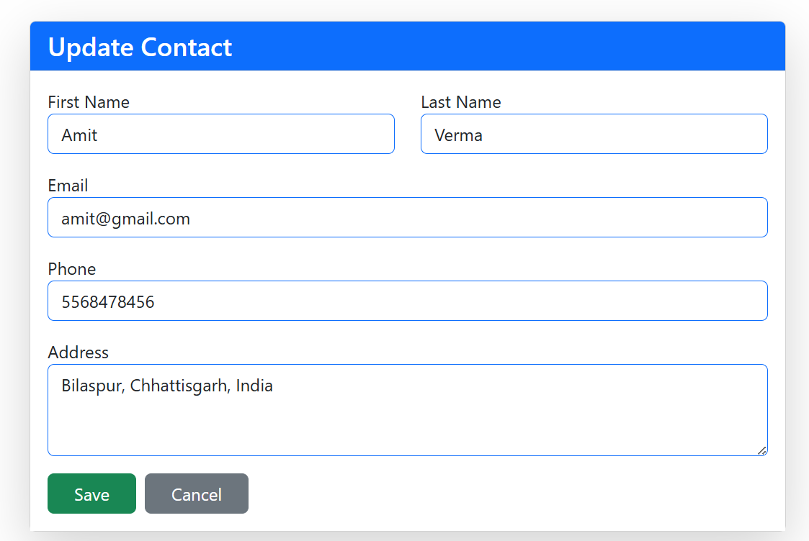
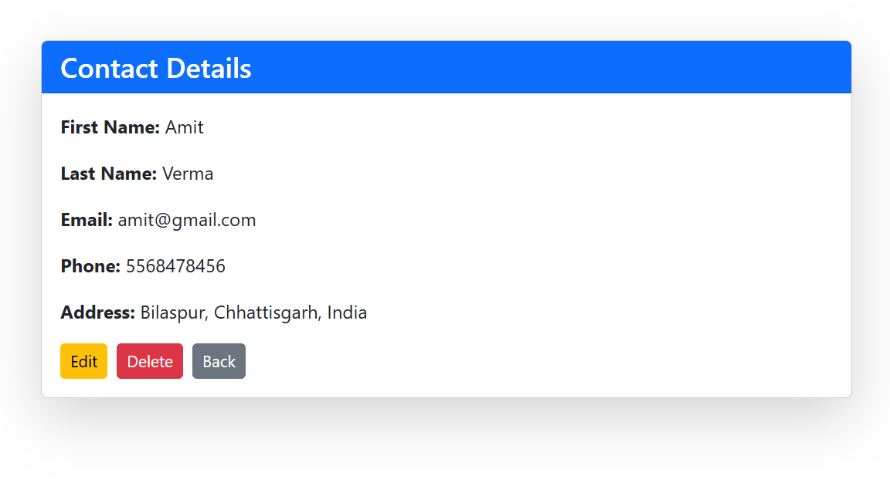

# CURD in Express & MongoDB

A simple **CRUD (Create, Read, Update, Delete)** web application built with **Express.js** and **MongoDB**.  
This project allows users to manage contacts by adding, viewing, updating, and deleting them through a clean and responsive UI.

---

## 🚀 Features
- Add new contact with details (Name, Email, Phone, Address)
- View contact details
- Update existing contacts
- Delete contacts
- Responsive and user-friendly interface

---

## 🛠️ Tech Stack
- **Backend:** Node.js, Express.js  
- **Database:** MongoDB  
- **Frontend:** HTML, CSS, Bootstrap  
- **Templating Engine:** EJS  

---

## 📸 Screenshots

### 📋 Contact Details


### ➕ Add New Contact


### ✏️ Update Contact


### 👤 Show Single Contact


---

## ⚙️ Installation & Setup

1. Clone the repository:
   ```bash
   git clone https://github.com/AbhaySharma3666/CURD_in_Express_Mongo.git
   ```
2. Navigate to the project folder:
   ```bash
   cd CURD_in_Express_Mongo
   ```
3. Install dependencies:
   ```bash
   npm install
   ```
4. Start MongoDB server (make sure MongoDB is running on your system).
5. Run the application:
   ```bash
   npm run dev
   ```
6. Open your browser and visit:
   ```
   http://localhost:3030
   ```

---

## 📂 Project Structure
```
CURD_in_Express_Mongo/
│-- models/        # Mongoose schemas
│-- routes/        # Express routes
│-- views/         # EJS templates
│-- public/        # Static files (CSS, JS)
│-- app.js         # Main application entry
│-- package.json   # Dependencies and scripts
```

---

## 🤝 Contributing
Contributions are welcome! Feel free to open issues or submit pull requests.

---

## 📜 License
This project is licensed under the **MIT License**.
